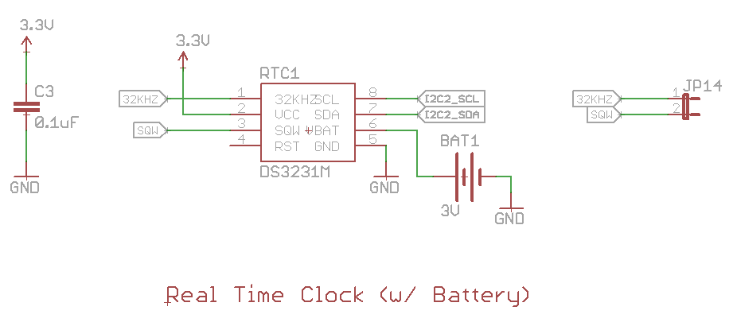
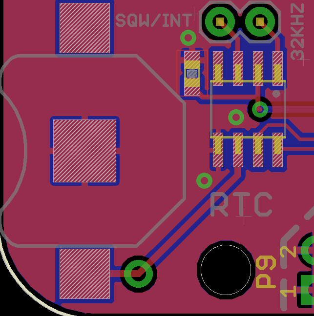
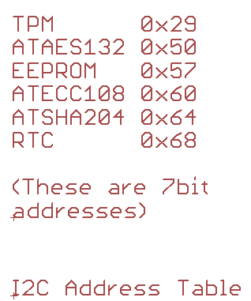

# Introduction to BeagleBone Black I2C with the CryptoCape Real-Time Clock

## Introduction

The CryptoCape is a BeagleBone Black Cape that contains several cryptographic ICs, an ATmega328p, and a Real-Time Clock (RTC).  This tutorial will describe the RTC on the CryptoCape, provide a brief primer on programming with I2C on the BeagleBone Black (BBB), and show how to configure your BBB to use the RTC.  This tutorial will cover the basics and in the *Going Further* section, there are ideas for more complex projects.

### Required Materials

You'll need the CryptoCape, which contains the DS3231M RTC from Maxim Integrated.

### Suggested Reading

The following background tutorials will help prepare you for the concepts below:

[I2C Overview](https://learn.sparkfun.com/tutorials/i2c/all)
[How to Read a Schematic](https://learn.sparkfun.com/tutorials/how-to-read-a-schematic)

## Hardware Overview

The CryptoCape has seven ICs, one of which is the Maxim Integrated DS3231M Real-Time Clock.  Why did I choose this RTC over the other two available from SparkFun and considering that the BBB has a RTC in the AM335x processor?  First of all, the DS3231M is in a small SOIC-8 package, which takes up less space then the [DeadOn RTC](https://www.sparkfun.com/products/10160).  Secondly, it doesn't require an external oscillator like the [Real Time Clock Module](https://www.sparkfun.com/products/99).  Beyond that, I wanted the device to communicate via I2C and operate at 3.3V.  Also, I wanted a fairly accurate module.  This RTC has a drift of less than 0.432 seconds per day.

While the BBB does have a RTC, connecting the battery from a cape to the very small test points on the BBB to provide power is a bit tricky.  Also, it was not clear to me that the battery would supply power just to the RTC and not the entire BBB.  This would deplete the battery much more rapidly.

Let's take a look at the RTC schematic and board file.  The RTC component sits on the left edge of the cape next to the coin cell battery holder.  It's supplied by 3.3V power with a decoupling capacitor (C3) and is connected to the I2C bus via its SDA and SCL pins.  The DS3231M can output a 32KHz signal and generate an interrupt.  These pins aren't used but they are broken out to 0.1" headers in the case that you want to use them.  The RTC is connected to the BBB via I2C on pins P9-19 (SCL) and P9-20 (SDA).  3.3V is supplied through pins P9-3 and P9-4 and ground is off of pins P9-1 and P9-2.

## Installation

Attaching the CryptoCape is easy as the cape only fits on one-way.  Insert the coin-cell into holder and you are ready to go!

## Primer on BBB I2C

The BBB has three independent I2C buses: i2c0, i2c1, and i2c2.  These are the names of the buses per the System Reference Manual (SRM).  We need to know two pieces of information to work with I2C on the BBB.  The first, is which pins on the expansion header correspond to the correct bus.  Then, we need to know how to access this bus in Linux.

If you are developing with the BBB, you *should* become familiar with the SRM.  It's extremely well documented and should be your first reference.  Table 13 shows the P9 expansion header and we can see that pins P9-17 and P9-18 are for I2C1 and pins P9-19 and P9-20 are for I2C2.  Note that I2C1 is also listed on pins P9-24 and P9-26 and I2C2 on P9-21 and P9-22.  This is because each pin can be "muxed" to different modes.  The CryptoCape uses I2C2 on pins P9-19 and P9-20, so that's what we'll use for the rest of the tutorial.

Next, perform the following command on the BBB:

    debian@arm:~$ ls -l /sys/bus/i2c/devices/i2c-*
    lrwxrwxrwx 1 root root 0 Feb 17 13:52 /sys/bus/i2c/devices/i2c-0 -> ../../../devices/ocp.3/44e0b000.i2c/i2c-0
    lrwxrwxrwx 1 root root 0 Feb 17 13:52 /sys/bus/i2c/devices/i2c-2 -> ../../../devices/ocp.3/4819c000.i2c/i2c-2

Notice that only two of the I2C buses are enumerated.  After the `ocp.3` we see the bus's address and per the AM335x Technical Reference Manual's (TRM) Table 2-3, the Peripheral Memory Map, the start address of the I2C buses are:

    i2c0: 0x44E0-B000
    i2c1: 0x4802-A000
    i2c2: 0x4819-C000

In our example above, `/sys/bus/i2c/devices/i2c-2` matches the address for the processor's `i2c2`, but that may not always be the case so it's useful to check.  We know that the DS3231M is attached to `/dev/i2c-2`.

## Firmware

Fortunately, support for the DS3231M is provided via the DS1037 Linux kernel driver.  In the Kernel, the code says "DS3231" not "DS3231M."  The differences between the DS3231 and the "M" version is the that the DS3231M has an internal, temperature compensated resonator and is comes in the SOIC-8 package.

We need to know the I2C address of the RTC, which can be found in the datasheet or in the super convenient I2C address table on the CryptoCape schematic.  Armed with that knowledge, lets inform the kernel about our RTC with:

    echo ds1307 0x68 | sudo tee /sys/class/i2c-adapter/i2c-2/new_device

You should now see *two* RTCs when you enter `ls /dev/rtc*`: `rtc0` and `rtc1`.  The BBB's rtc is `rtc0`, the CryptoCape's is `rtc1`.

### Getting the time

First, we need to update the system time on the BBB.  You can quickly check the time by typing `date` and if you never updated your BBB's clock, it's most likely off by a matter of months.  We can update the system time on the BBB using NTP, the Network Time Protocol.  It's easy enough to do with the following command:

    sudo ntpdate -b -u pool.ntp.org

This feels a bit impersonal to me though.  You don't have to use the pooled NTP servers, if you know of a [close server](http://tf.nist.gov/tf-cgi/servers.cgi), you can use that address and "support" your local NTP server ;)

    sudo ntpdate -b -u wwv.nist.gov

### Setting the time

The `hwclock` utility handles setting the time on the DS3231M.  Because there are two RTCs, we need to specify *which* one to set (the `-f` option) and also supply the `-w` option to write the time.  This will set the hwclcok to match the current system time.

    sudo hwclock -w -f /dev/rtc1

Verify the time with:

    sudo hwclock -r -f /dev/rtc1

That's it!  The time is now set on the clock and should maintain its time when main power is disconnected with a battery attached.

## Resources and Going Further

### Going Further

The `hwclock` utility has many more features, including a way to compensate for system drift.  The man page is worth a read and contains suggestions for how to script setting the system time on startup.  When developing your script, consider the case when the CryptoCape is not installed (i.e. when `/dev/rtc1` is not there).

For those looking for a more secure way to set the time, check out Jacob Appelbaum's [`tlsdate`](https://github.com/ioerror/tlsdate) utility.  Jacob Appelbaum, among other things, is a prominent developer on the Tor Project and created this utility for Tor routers to set their time securely.  It uses a clever technique to grab the time from the Transport Layer Security (TLS) handshake.

The DS3231M keeps time, but it also some other interesting features like a line to automatically debounce a reset signal, from a push button for example.  If you wanted, you could modify the kernel driver or you can start from my re-engineered user-space driver on [GitHub[(https://github.com/cryptotronix/rtc).  At the moment, it only sets and gets the time, but it should provide the infrastructure if you want to add features.  Pull requests welcome!

### Resources

- [Datasheet](http://datasheets.maximintegrated.com/en/ds/DS3231M.pdf) for DS3231M.
- [BBB I2C References](http://datko.net/2013/11/03/bbb_i2c/)
- [BBB System Reference Manual](https://github.com/CircuitCo/BeagleBone-Black/blob/master/BBB_SRM.pdf?raw=true)
- [AM335x Technical Reference Manual](http://www.ti.com/lit/ug/spruh73j/spruh73j.pdf)
- [DS1307 Driver](http://lxr.free-electrons.com/source/drivers/rtc/rtc-ds1307.c?v=3.8;a=arm)
